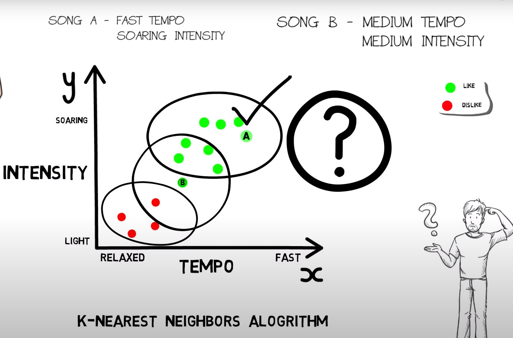

# Machine Learning Starter

Machine Learning starter is a repo designed to contain teaching data and notes on the machine learning subject.
The majority of the code will be in python.
This will include notes on how to start simple projects and download all needed files.

## Table of contents

- [Machine Learning Starter](#machine-learning-starter)
  - [Table of contents](#table-of-contents)
  - [About Machine Learning](#about-machine-learning)
  - [Supervised learning](#supervised-learning)
  - [Unsupervised learning](#unsupervised-learning)
  - [Reinforcement learning](#reinforcement-learning)
  - [Librarues](#librarues)
  - [Environments and Installs](#environments-and-installs)
  - [Alogrythums](#alogrythums)
  - [Data](#data)
  - [Juypter](#juypter)
  - [IPython](#ipython)
  - [Code Examples](#code-examples)
    - [Basic](#basic)

## About Machine Learning

What is machine learning?

By using statistics, computers can learn how to use specific tasks.
The computer will learn patterns and make assumptions about what it is looking at.
For example if you feed in pictures of cats and dogs, i will start to thing cats are the ones with shorter noses.
The more data the more finely tuned it can become.
This is how text to speach, spam filters, fraud detection.

Here is a basic example.
The Machine learns from the graph what songs he will like and dislike, then can make predictions about new songs. If the song lies somewhere in the middle of like and dislike. This algorythm is using the closest neigbours 'K-Nearest neighbors algortythm'.


## Supervised learning

The machine already knows the labels and features of the objects it will be learning about.
For a collection of coins recognised by weight.
Weight = Feature
Currency = Label

## Unsupervised learning

Unlabelled training data.

## Reinforcement learning

Provide the project with data and tell it right from wrong.

## Librarues

1. Numpy - Basic maths
2. Pandas
3. MatPlotLib
4. Scikit-Learn
5. TensorFlow

## Environments and Installs

Anaconda - Environment manager
Jupyter Code editor -

## Alogrythums

There are various types of alogrythums that can be used for different teaching styles and objectives.

## Data

## Juypter

What is Jupyter?

A pip install that allows you to view datasets.

`pip install jupyterlab` install on cmd
`jupyter notebook` open notebook

## IPython

An extension of python to make it more interactive

## Code Examples

### Basic

```py
import tensorflow as tf
from tensorflow import keras
import numpy as np
import matplotlib.pyplot as plt

data = keras.datasets.fashion_mnist

print(data)

(train_images, train_labels), (test_images, test_labels) = data.load_data()

class_names = ['T-shirt/top', 'Trousers', 'Pullover', 'Dress', 'Coat', 'Sandal', 'Shirt', 'Sneaker', 'Bag', 'Ankle boot']

train_images = train_images/255.0
test_images = test_images/255.0


# Flatten the data
model = keras.Sequential([
    keras.layers.Flatten(input_shape=(28,28)), # 28 or 128 neurons # first layer input layer
    keras.layers.Dense(128, activation="relu"), # rectify linear units # layer of data
    keras.layers.Dense(10, activation="softmax") # results - all add up to 1
])

model.compile(optimizer="adam", loss="sparse_categorical_crossentropy", metrics=["accuracy"])

model.fit(train_images, train_labels, epochs=10) # more does not equal better

test_loss, test_acc = model.evaluate(test_images, test_labels)

print("Test acc: ", test_acc)
```
